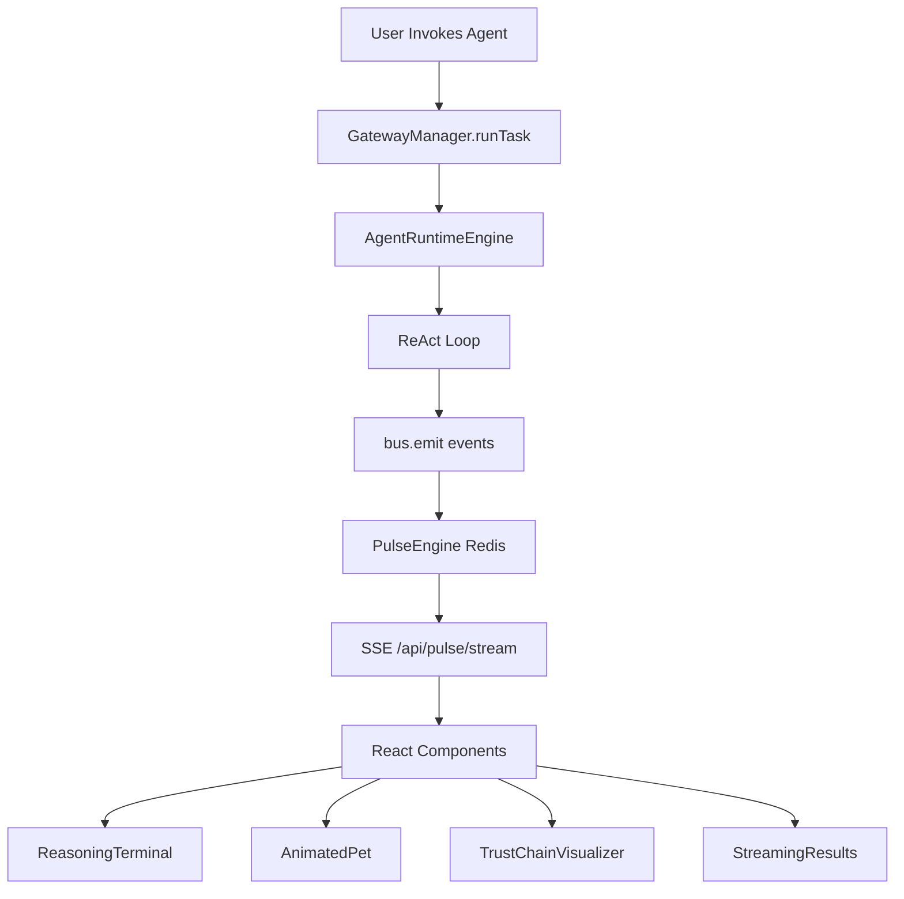

# 🎭 AIX Interactive Development Environment

> **Making AI Transparent Through Multi-Dimensional Visualization**

The AIX Interactive Development Environment transforms opaque AI agent execution into a rich, multi-layered visual experience. Watch your agents think, act, learn, and evolve in real-time across synchronized visual components.

---

## 🌟 Overview

Traditional AI development is a black box. You send a request, wait, and get a response. You have no idea what happened in between.

**AIX changes that.**

Every agent invocation triggers **5 simultaneous visual layers** that update in real-time:

1. **🧠 Reasoning Terminal** - Live ReAct loop (Thought → Action → Observation)
2. **🐾 Animated Pet** - Mood-driven character responding to system events
3. **⛓️ Trust Chain Visualizer** - Real-time PoW mining and verification nodes
4. **📊 Dynamic Form** - Adaptive UI that responds to agent state
5. **🌊 Streaming Results** - Progressive disclosure of computational output

---

## 🏗️ Architecture

### Event Bus (Nervous System)

All components communicate through a **4-ring event bus** architecture:

```typescript
BUS_RINGS = {
  GENESIS : 0,  // Rust DNA signing/verification
  SOUL    : 1,  // Identity, KYC, Pets, Dead Hand
  MIND    : 2,  // Go routing, TS Hermes learning
  BODY    : 3,  // MCP gateway, Channels, Economics
}
```

**Key Files:**
- [`packages/aix-core/src/bus.ts`](../packages/aix-core/src/bus.ts) - Event bus implementation
- [`packages/aix-core/src/pulse.ts`](../packages/aix-core/src/pulse.ts) - Redis-backed event stream (100 event buffer)

### Data Flow



---

## 🎨 Visual Components

### 1. Reasoning Terminal (`ReasoningTerminal.tsx`)

**Location:** [`apps/studio/src/components/studio/ReasoningTerminal.tsx`](../apps/studio/src/components/studio/ReasoningTerminal.tsx)

**Purpose:** Display the agent's internal reasoning process as it happens.

**Events Consumed:**
- `THOUGHT_GENERATED` - Agent reasoning step
- `ACTION_EXECUTING` - Tool execution
- `OBSERVATION_RECORDED` - Tool result
- `REFLECTION_COMPLETE` - Step completion

**Visual Features:**
- Syntax-highlighted code blocks
- Step-by-step progression
- Collapsible sections
- Auto-scroll to latest

**Example Output:**
```
💭 Step 1: I need to search for market data
⚡ Action: search({ query: "Q2 market trends" })
👁️ Observation: Found 3 relevant reports...
✅ Step 1 complete
```

---

### 2. Animated Pet (`AnimatedPet.tsx`)

**Location:** [`apps/studio/src/components/studio/AnimatedPet.tsx`](../apps/studio/src/components/studio/AnimatedPet.tsx)

**Purpose:** Visual representation of agent mood and system health.

**Events Consumed:**
- `PET_MOOD_CHANGED` - Mood transitions (ecstatic → tired)
- `PET_LEVELED_UP` - Experience milestones
- `PET_ACCESSORY_UNLOCKED` - Rewards

**Mood States:**
```typescript
type PetMood = 
  | 'ecstatic'    // τ=0.9 (high quality)
  | 'energized'   // τ=0.8
  | 'happy'       // τ=0.7
  | 'busy'        // τ=0.4
  | 'curious'     // τ=0.3
  | 'tired'       // τ=0.2
  | 'sleep'       // τ=0.1 (hibernated)
```

**Animation Behaviors:**
- Bounces when happy
- Slows down when tired
- Sparkles on level-up
- Sleeps when hibernated

**Research Foundation:**
- Harvard SCORE (2025): Mood → Quality Threshold (τ)
- Dynamic constraint adaptation based on system load

---

### 3. Trust Chain Visualizer (`TrustChainVisualizer.tsx`)

**Location:** [`apps/studio/src/components/studio/TrustChainVisualizer.tsx`](../apps/studio/src/components/studio/TrustChainVisualizer.tsx)

**Purpose:** Real-time visualization of blockchain-style trust verification.

**Events Consumed:**
- `TRUST_TX_MINING` - PoW mining progress (every 10 nonces)
- `TRUST_TX_MINED` - Block successfully mined
- `TRUST_SCORE_UPDATED` - Trust score changes

**Visual Features:**
- Animated mining progress
- Block chain visualization
- Hash verification display
- Trust score graph

**Cryptographic Details:**
```typescript
// Proof of Work: hash must start with "0"
// Average time: ~10ms
// Emits progress every 10 nonces
```

**Research Foundation:**
- Satoshi Nakamoto: "The root problem with conventional currency is all the trust that's required"
- Cryptographic proof without trusted third parties

---

### 4. Dynamic Form (`AgentInvokePanel.tsx`)

**Location:** [`apps/studio/src/components/studio/AgentInvokePanel.tsx`](../apps/studio/src/components/studio/AgentInvokePanel.tsx)

**Purpose:** Adaptive UI that responds to agent state and capabilities.

**Features:**
- Real-time validation
- Mood-aware constraints
- Tool selection based on capabilities
- Cost estimation

---

### 5. Streaming Results (`StreamingResults.tsx`)

**Purpose:** Progressive disclosure of agent output.

**Features:**
- Chunk-by-chunk rendering
- Markdown support
- Code syntax highlighting
- Auto-scroll

---

## 🔌 API Endpoints

### SSE Stream Endpoint

**Location:** [`apps/studio/src/app/api/pulse/stream/route.ts`](../apps/studio/src/app/api/pulse/stream/route.ts)

**Purpose:** Server-Sent Events endpoint for real-time updates.

**Usage:**
```typescript
const eventSource = new EventSource('/api/pulse/stream');

eventSource.onmessage = (event) => {
  const busEvent = JSON.parse(event.data);
  console.log(busEvent.type, busEvent.message);
};
```

**Configuration:**
- Polling interval: 200ms (optimized from 500ms)
- Event buffer: 100 events (Redis LRANGE)
- Auto-reconnect on disconnect

---

## 🎯 Event Types Reference

### Ring 0 — GENESIS (Trust & Security)

| Event Type | Emitted By | Purpose |
|------------|-----------|---------|
| `TRUST_TX_MINING` | trust-chain.ts | PoW mining progress |
| `TRUST_TX_MINED` | trust-chain.ts | Block successfully mined |
| `TRUST_SCORE_UPDATED` | trust-chain.ts | Trust score changed |
| `DNA_VERIFIED` | aix-dna (Rust) | Manifest signature valid |
| `DNA_TAMPERED` | aix-dna (Rust) | Tamper detected |

### Ring 1 — SOUL (Identity & Pets)

| Event Type | Emitted By | Purpose |
|------------|-----------|---------|
| `PET_MOOD_CHANGED` | pets.ts | Mood transition |
| `PET_LEVELED_UP` | pets.ts | Experience milestone |
| `PET_ACCESSORY_UNLOCKED` | pets.ts | Reward unlocked |
| `AGENT_HIBERNATED` | pets.ts | 7-day inactivity |

### Ring 2 — MIND (Reasoning & Learning)

| Event Type | Emitted By | Purpose |
|------------|-----------|---------|
| `THOUGHT_GENERATED` | agent-runtime.ts | ReAct reasoning step |
| `ACTION_EXECUTING` | agent-runtime.ts | Tool execution |
| `OBSERVATION_RECORDED` | agent-runtime.ts | Tool result |
| `REFLECTION_COMPLETE` | agent-runtime.ts | Step complete |
| `STEP_STARTED` | agent-runtime.ts | New step begins |
| `SKILL_EXTRACTED` | learning.ts | New skill learned |

### Ring 3 — BODY (Execution & Economics)

| Event Type | Emitted By | Purpose |
|------------|-----------|---------|
| `RESULT_CHUNK` | streaming | Partial result |
| `RESULT_COMPLETE` | streaming | Final result |
| `METRICS_UPDATED` | gateway.ts | Performance metrics |
| `PAYMENT_SETTLED` | economics.ts | Transaction complete |

---

## 🚀 Usage Examples

### Basic Agent Invocation

```typescript
import { GatewayManager } from '@aix/core';

const result = await GatewayManager.runTask(
  'agent-123',
